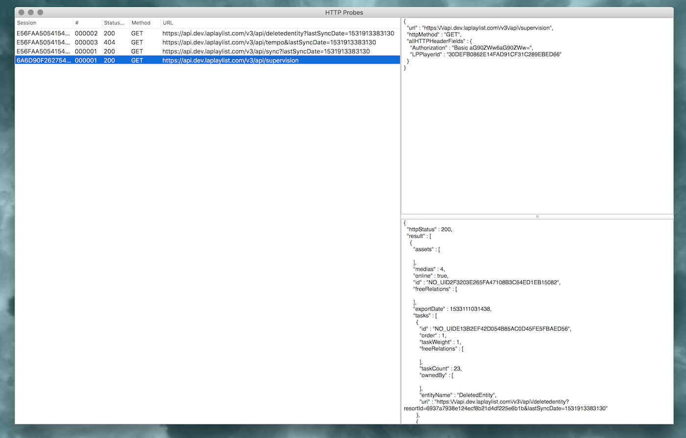

# Probes

A simple App to inspect Bartleby's Core HTTP probes

# Install

- Build yourself: You currently need Xcode 10 + use legacy build system to build probes.
- Download: [The signed binary v1.0.2](https://github.com/Bartlebys/Probes/releases/download/v1.0.2/Probes.app.zip). 

